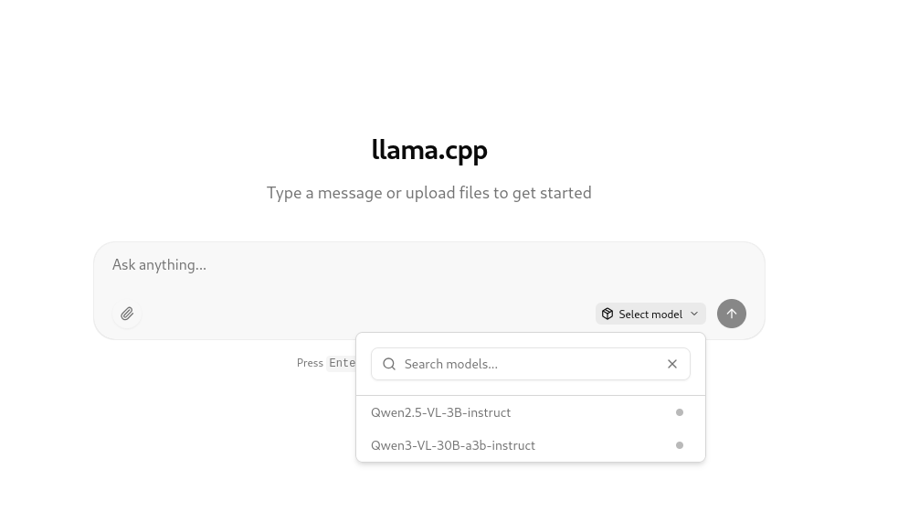
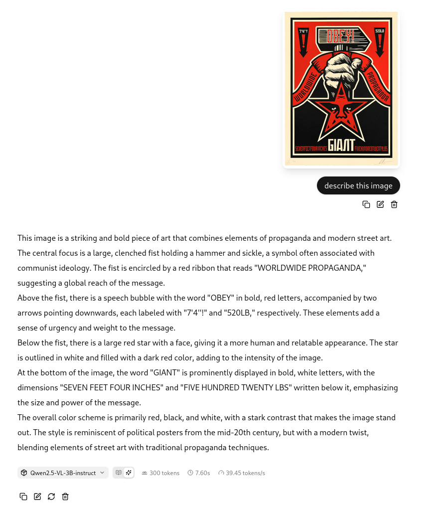
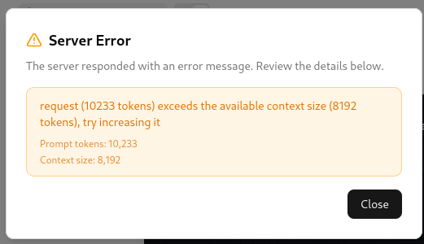

# llamacpp-cuda-arm64-docker
This repository helps you build your own llama.cpp Docker image with CUDA support for ARM64 architectures (tested on NVIDIA DGX Spark).

## Hardware Requirements

- **Architecture**: ARM64 (aarch64)
- **GPU**: NVIDIA GPU with CUDA support (e.g., NVIDIA GB10 or similar)
- **VRAM**: Minimum 8GB for small models (3B-7B parameters), 24GB+ recommended for larger models (30B+)
- **Drivers**: NVIDIA driver version 535+ with CUDA 12.0+ support
- **OS**: Linux (Ubuntu 22.04/24.04 recommended)

## Prerequisites

To compile this Docker image, you need a fully working NVIDIA ARM64-based Linux system with all drivers installed, including CUDA. This means you should already be able to run llama.cpp or any AI workload efficiently on your system by offloading most of the processing to the GPU.

## Check Your System

Verify your system is properly configured by running these commands:
```
$ nvcc --version
nvcc: NVIDIA (R) Cuda compiler driver
Copyright (c) 2005-2025 NVIDIA Corporation
Built on Fri_Nov__7_07:24:07_PM_PST_2025
Cuda compilation tools, release 13.1, V13.1.80
Build cuda_13.1.r13.1/compiler.36836380_0

$ nvidia-smi 
Wed Dec 31 01:42:54 2025       
+-----------------------------------------------------------------------------------------+
| NVIDIA-SMI 580.95.05              Driver Version: 580.95.05      CUDA Version: 13.0     |
+-----------------------------------------+------------------------+----------------------+
| GPU  Name                 Persistence-M | Bus-Id          Disp.A | Volatile Uncorr. ECC |
| Fan  Temp   Perf          Pwr:Usage/Cap |           Memory-Usage | GPU-Util  Compute M. |
|                                         |                        |               MIG M. |
|=========================================+========================+======================|
|   0  NVIDIA GB10                    On  |   0000000F:01:00.0 Off |                  N/A |
| N/A   39C    P8              3W /  N/A  | Not Supported          |      0%      Default |
|                                         |                        |                  N/A |
+-----------------------------------------+------------------------+----------------------+

+-----------------------------------------------------------------------------------------+
| Processes:                                                                              |
|  GPU   GI   CI              PID   Type   Process name                        GPU Memory |
|        ID   ID                                                               Usage      |
|=========================================================================================|
|  No running processes found                                                             |
+-----------------------------------------------------------------------------------------+
```

---

## Setup Environment Variables

Set the appropriate environment variables in your `~/.bashrc` based on your CUDA version. For CUDA 13.1, add the following:

```
# CUDA 13.1 & GCC 12 Fix for ARM64
export PATH=/usr/local/cuda-13.1/bin:$PATH
export LD_LIBRARY_PATH=/usr/local/cuda-13.1/lib64:$LD_LIBRARY_PATH
export CUDA_PATH=/usr/local/cuda-13.1
export CC=gcc-12
export CXX=g++-12
export CUDACXX=/usr/local/cuda-13.1/bin/nvcc
```

Then, relogin or load the file to make the changes effective.
```
$ . ~/.bashrc
```

## Clone Repository (with Submodule)

Clone this repository with the `llama.cpp` submodule:
```
$ git clone --recurse-submodules https://github.com/cslev/llamacpp-cuda-arm64-docker.git
```

If you cloned without the submodule, initialize it manually:
```
$ cd llamacpp-cuda-arm64-docker
$ git submodule update --init --recursive
```

# Docker Image

You have two options: pull the prebuilt image or build it yourself.

## Option 1: Pull Prebuilt Image (Recommended)

Pull the prebuilt image from Docker Hub:
```
$ sudo docker pull cslev/llamacpp-cuda-arm64:latest
```

## Option 2: Build From Source

Build the multi-stage Docker image locally. This process may take 20-30 minutes, similar to the native compilation time.
```
$ sudo docker build -t cslev/llamacpp-cuda-arm64:latest .
```

# Download Models

Create a Python environment and install the `huggingface-hub` library to download models. In this example, we'll use a small vision model to test both text generation and image understanding capabilities.

## Install Python Virtual Environment
```
$ python3 -m venv .venv
$ source .venv/bin/activate
$ pip install -U "huggingface_hub"
```
## Download a Small Vision Model

First, download the model (GGUF) file:
```
$ hf download ggml-org/Qwen2.5-VL-3B-Instruct-GGUF Qwen2.5-VL-3B-Instruct-Q8_0.gguf --local-dir ./models/
```

Then, download the mmproj file for image input:
```
$ hf download ggml-org/Qwen2.5-VL-3B-Instruct-GGUF   mmproj-Qwen2.5-VL-3B-Instruct-Q8_0.gguf --local-dir ./models/
```

# Configure models.ini

Edit the `models.ini` configuration file to register your downloaded models. This file maps each model to its associated files (including vision projectors for multimodal models).
```
$ nano models/models.ini
```
Then, modify and add new entries as per your requirements. Here, we just set up the model we just downloaded.
```
# Settings for Qwen2.5-VL
[Qwen2.5-VL-3B-instruct]
model = /models/Qwen2.5-VL-3B-Instruct-Q8_0.gguf
mmproj = /models/mmproj-Qwen2.5-VL-3B-Instruct-Q8_0.gguf
```

# Deploy

Use the provided `docker-compose.yml` file to deploy the llama.cpp container:
```
$ sudo docker-compose up
```

Once the stack is running, navigate to http://localhost:3000. You should see a fully-fledged llama.cpp instance with CUDA support running on your ARM64 system within an isolated Docker container.

<p align="center">
  
</p>

---

## Testing Vision Capabilities

After selecting a model, wait a few seconds until it is fully loaded and the **Images** attachment option becomes active. Upload an image and ask the vision language model to describe it.

As shown below, the performance is excellent. The response is generated in seconds, and the token/s metric confirms the GPU is working effectively (~80-100 tokens/s on DGX Spark vs ~10 tokens/s CPU-only).

<p align="center">
  
</p>

---

# Troubleshooting

## Context Size Errors

If you encounter "context size exceeded" errors when processing multiple images:

- **Issue**: Each image consumes ~1000-4000 tokens depending on resolution
- **Solution**: Increase `--ctx-size` in `docker-compose.yml` (default: 32768)
- **Example**: For 4+ images, use `--ctx-size 65536`
- **STILL AN ISSUE**: the `--context-shift` argument supposed to shift out old context so you won't bump into errors in a chat when keep uploading new images or text. However, it is know (as of now) that llama.cpp and vision models have this issue of not shifting the context and you bump into an error. In those cases, you need to open a new chat.
<p align="center">
  
</p>

## CUDA Not Detected

If the GPU is not being utilized:

1. Verify NVIDIA drivers: `nvidia-smi`
2. Check CUDA installation: `nvcc --version`
3. Ensure Docker has GPU access: `sudo docker run --rm --gpus all nvidia/cuda:12.0-base nvidia-smi`
4. Verify the `deploy.resources.reservations.devices` section in `docker-compose.yml`

## Model Loading Failures

If models fail to load:

- Verify file paths in `config/models.ini` match actual file locations in `./models/`
- Ensure both `.gguf` and `.mmproj` files are downloaded for vision models
- Check file permissions: models should be readable by the container

## Performance Issues

- **Low tokens/s**: Increase `--n-gpu-layers` (default: 99) or reduce `--parallel` if memory-constrained
- **High memory usage**: Use lower quantization models (Q4_K_M instead of Q8_0)
- **Flash attention**: Ensure `--flash-attn` is enabled for better performance

---

# Why This Repository?

This repository exists because:

1. **ARM64 + CUDA is niche**: Most llama.cpp Docker images target x86_64
2. **Vision models need special handling**: The `models.ini` approach simplifies mmproj mapping
3. **Reproducibility matters**: Pinning llama.cpp as a submodule ensures consistent builds
4. **DGX Spark specifics**: Tuned for NVIDIA's ARM64 platform with optimal flags

## Contributing

Found a bug or have an improvement? PRs welcome!

## License

This repository follows the same license as llama.cpp. See [llama.cpp/LICENSE](https://github.com/ggml-org/llama.cpp/blob/c8a37980419e8b7f0193d058fb6f8f01b458cfca/LICENSE) for details.

